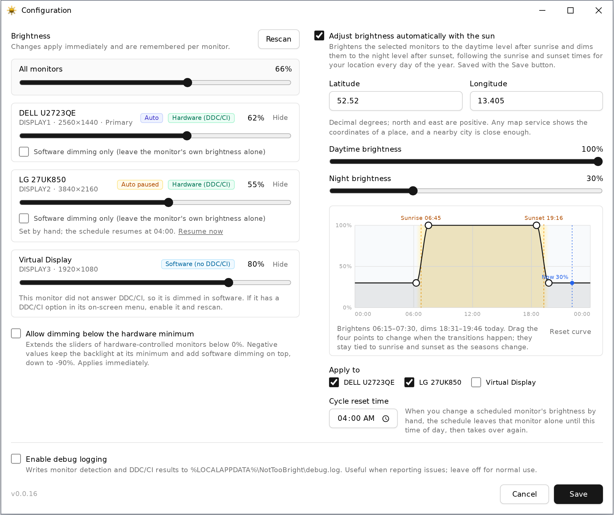

# Not Too Bright

**Dim every screen from the system tray — no more hunting for buttons on the back of the monitor.**

Laptops get brightness keys. Desktop monitors get a five-button menu and a
Windows that pretends the backlight does not exist. Not Too Bright is a tiny,
single-file Windows tray app that fixes that: real backlight control over
DDC/CI where the monitor allows it, a laptop's built-in display through
Windows' own brightness control, a software dimming fallback everywhere
else, and an optional schedule that follows the sun for your location.



## Highlights

- **Real backlight control** - Talks DDC/CI to the monitor, the same channel its own menu uses, so dimming keeps full contrast and saves power
- **Laptop screens too** - A built-in display is driven through Windows' own brightness control, the one its brightness keys use; changes made with the keys or in Windows show up in the app
- **Works on anything** - Monitors without DDC/CI (docks, KVMs, virtual displays, remote sessions) get a click-through software overlay instead
- **One slider per monitor** - Plus *All monitors*; changes apply live while you drag and are remembered per monitor
- **Follows the sun** - Optional day/night levels with smooth dawn and dusk transitions computed for your latitude and longitude, shown on an editable graph
- **Manual override that makes sense** - Touch a scheduled monitor's slider and the schedule pauses until a reset time you choose
- **Below the minimum** - Optionally continue below 0% on hardware monitors by adding software dimming on top of the lowest backlight setting
- **Hide what you do not want touched** - Remove a monitor from the app entirely until the next rescan; its original brightness is restored first
- **Never black, never in screenshots** - Software dimming stops at 10% and its overlay is excluded from screen capture and screen sharing
- **Zero install** - One 620 KB executable, no runtime to install, settings in your user registry, nothing written next to the exe
- **Self update** - Checks this repository for a newer build, shows both version numbers, and replaces itself in place after a standard UAC prompt; automatic checks can be turned off
- **Survives everything** - Settings follow the monitor (by EDID) and are re-applied after sleep, after displays are switched back on, and after display changes

## Getting Started

1. Download [`releases/NotTooBright.exe`](releases/NotTooBright.exe) and run it. An icon appears in the system tray.
2. Double-click the icon. Every connected monitor gets a card with a slider and a badge showing how it is controlled.
3. Drag. That is it - values are remembered per monitor and restored next time.

Hover the icon for a tooltip listing every monitor and its current
brightness, headed by a **Schedule** line (*Disabled*, *Active*, or *Paused*
after a manual change) and, while the schedule is enabled, a **State** line
(*Daytime*, *Night*, *Deep sleep*, or the transition in progress,
*Daytime → Night*, *Night → Daytime* or *Night → Deep sleep*). Right-click it for **Configure** and **Exit**, plus **Increase
brightness** / **Decrease brightness** and any preset levels you have listed
once you have chosen which monitor the menu controls (see *Tray menu
brightness control*), and **Resume schedule** while a manual change has
paused the schedule. Requires Windows 10 or 11
(64-bit) and the [WebView2 Runtime](https://developer.microsoft.com/en-us/microsoft-edge/webview2/),
which is already installed on virtually every Windows 10/11 machine.

## How Brightness Control Works

For every connected monitor Not Too Bright first tries **DDC/CI**, the
control channel monitors expose over their video cable. It reads and writes
the standard VCP brightness code (0x10), so the change is the same one you
would make with the monitor's own buttons: the backlight actually gets
dimmer, with no loss of contrast. All DDC/CI traffic runs on a background
thread with retries, because a single command can take a while and some
monitors are slow or flaky. If a driver refuses the raw VCP request but
accepts the high-level Monitor Configuration API, that route is used instead.

A laptop's built-in display has no DDC/CI. Windows controls its backlight
itself, and Not Too Bright uses that same control (WMI, see
[Built-in Displays](#built-in-displays)); such a display is recognised and
set up before any DDC/CI traffic starts.

When a monitor does not answer (DDC/CI disabled in its on-screen menu, some
docks, KVMs, USB-C hubs, DisplayLink adapters, virtual machines, remote
sessions), the monitor is switched to **software dimming**: a topmost,
click-through black overlay whose transparency follows the slider. It cannot
lower the backlight, but it works everywhere, needs no driver support, and
never affects screenshots or screen sharing.

A monitor that has answered DDC/CI before is treated differently when it
stops responding (a flaky request after a display change, a KVM switched
away, a cable swap): its backlight may well be sitting below 100% from an
earlier setting, and dimming it in software on top of that would stack the
two. Such a monitor is left exactly as it is, shown as *DDC/CI not
answering*, and retried automatically with a growing delay (3 s, 6 s, ... up
to once a minute) until it answers again; its slider applies as soon as it
does. **Software dimming only** remains available as an explicit choice in
the meantime. Monitors that have never answered are re-probed a few times
after start-up and otherwise use software dimming.

Both methods sit behind the same per-monitor slider. With **Allow dimming
below the hardware minimum** enabled, the slider of a hardware-controlled
monitor extends to -90%: values below 0% keep the backlight at its minimum and
add software dimming on top, for monitors whose lowest setting is still too
bright.

Each monitor is identified by the model and serial number in its EDID, so the
chosen brightness is remembered per monitor and re-applied whenever monitors
are re-detected: after resuming from sleep, after the displays are switched
back on, after resolution or layout changes, and on every start. The first
time a monitor is seen its current hardware brightness is adopted as is, so
nothing changes until you move the slider, and that original value is
recorded for good: hiding the monitor later restores it before the
application lets go of the monitor.

## Built-in Displays

A laptop's own screen, or any display whose brightness Windows controls
itself, shows up with a **Hardware (built-in)** badge. Not Too Bright sets
its brightness through Windows' brightness control (WMI:
`WmiMonitorBrightness` and `WmiSetBrightness`), the same control the
brightness keys, the quick settings slider and Settings use, so the
backlight really changes, in the steps the panel supports. Everything else
works as for any other monitor: the slider, **All monitors**, the schedule,
the tray menu, **Hide** (which puts back the level the display had when it
was first seen), and dimming below the minimum.

Windows keeps its own ways of changing that brightness, and Not Too Bright
follows them as they happen:

- A change you make in Windows - the laptop's brightness keys, the quick
  settings slider, Settings - shows up on the display's card and in the
  tray tooltip, is remembered, and counts as a manual change, so it pauses
  the schedule like moving the slider would.
- When Windows dims the display after a period of inactivity, or switches
  it off, nothing is written to it; a level the schedule reaches meanwhile
  is applied once the display is on again.
- Windows applies a level of its own after sleep, when the display comes
  back on, when you plug in or unplug the charger, and when battery saver
  turns on or off. The level set in Not Too Bright replaces it a few
  seconds later.

With debug logging on, everything about built-in displays is logged under
`[PANEL]`: what Windows reports, each change, and how it was taken.

## Automatic Brightness

Enable **Adjust brightness automatically with the sun** in the dialog, enter
your latitude and longitude (decimal degrees, north and east positive; a
nearby city is close enough), and choose a daytime and a night level. From
then on the selected monitors are brightened to the daytime level after
sunrise and dimmed to the night level after sunset, every day of the year,
using sunrise and sunset times computed for your location and the current
date.

The graph shows today's curve: the shaded band is daylight, the dashed
lines mark sunrise and sunset, and the blue marker is the current moment.
The four points shape the transitions - when the morning ramp starts and
reaches full brightness, and when the evening ramp starts and reaches the
night level. Drag them to taste; they are stored as offsets from sunrise and
sunset, so the curve keeps following the seasons instead of freezing at a
clock time. When an evening transition overlaps the next morning, the stronger
daytime contribution takes precedence so the curve stays continuous across
midnight. **Reset curve** restores the defaults (half an hour on either
side of sunrise and sunset). Where the sun does not rise or set on a given
day, the night or daytime level simply applies all day.

**Deep sleep** is optional: at a time of day you choose (23:30 by default)
the selected monitors fade over five minutes to a deep sleep level of their
own, usually darker than the night level (it can be brighter too), and stay
there until the next morning's transition, which then brightens them
straight from the deep sleep level. Unlike the four points above, the deep
sleep time is a fixed clock time. On the graph, deep sleep shows as a
shaded band with a line and a point of its own; drag the point to change
the time. Where the sun does not rise, deep sleep lasts until midday.

The schedule is evaluated every 30 seconds and writes to a monitor only when
the rounded percentage changes. Solar times are cached for the current date,
location, and Windows time-zone settings; clock/settings changes and resume
invalidate the cache. Locking the workstation does not stop the schedule.
The overlay's 1.5-second check runs only while a dimming overlay is visible,
and unchanged schedule ticks do not queue tooltip updates.

The tray icon's tooltip shows where the
schedule currently is: **State: Daytime** or **State: Night** on the two
plateaus, **State: Daytime → Night** while dusk is dimming the monitors and
**State: Night → Daytime** while dawn is brightening them, **State: Night →
Deep sleep** during the fade and **State: Deep sleep** after it, and a **Schedule**
line that reads **Disabled**, **Active**, or **Paused**. If you change a
scheduled monitor's brightness by hand (its slider, **All monitors**, or
the tray menu), the schedule pauses for every monitor it controls until
the **cycle reset time** you set (04:00 by default), so an adjustment you
make in the evening is not undone a minute later; each scheduled card
shows *Auto paused* with a **Resume now** link, and resuming from any card,
from the tray menu's **Resume schedule** item, or by saving the schedule
again resumes the schedule for all of them.
Hidden monitors are never
scheduled. The night level can only go below 0% when **Allow dimming below
the hardware minimum** is enabled, and each monitor clamps the scheduled
value to its own range.

## Keyboard Brightness Keys

Many keyboards have Brightness Up and Brightness Down keys. Windows reacts
to them by showing its brightness flyout, but only a laptop's built-in
panel actually changes; external monitors are ignored. With **Use the
keyboard's brightness keys** enabled, each press moves every listed external
monitor by 10% from its own value, whatever window is focused, and counts as
a manual change for the schedule. Holding a key repeats on keyboards that
send repeated reports. Windows keeps showing its flyout and keeps moving a
built-in display itself; Not Too Bright picks that change up (see
[Built-in Displays](#built-in-displays)).

The keys are not ordinary key codes but usages on the keyboard's HID
consumer-control collection, so Not Too Bright opens that collection
directly and reads its reports; a keyboard whose brightness keys are
handled by the vendor's own software rather than sent as standard HID
usages cannot be seen this way. With debug logging on, the `[INPUT]` lines
show which collections were opened and every report they send, which is
the first thing to check when a key does nothing.

## Remote Desktop

When the session is viewed through Remote Desktop, Windows replaces the
real displays with a virtual one, and neither DDC/CI nor a dimming overlay
belongs there. Not Too Bright detects this (the `SM_REMOTESESSION` metric
plus the console-session check Microsoft documents for the sessions that
metric misses, re-evaluated on every session and display change) and
pauses: the monitors keep whatever brightness they have, nothing is probed,
written, scheduled, or dimmed, and the overlays leave the remote desktop.
The tray tooltip starts with **Remote Desktop session: paused**, the tray
menu's brightness items are greyed out, and the dialog shows the monitors
exactly as they were at the computer, with a notice and their controls
disabled; the settings can still be changed and saved. A session that was
disconnected without signing out counts as remote too. Once the session is
back at the console the monitors are re-detected and the stored values are
applied again.

Other remote-control tools (VNC, TeamViewer, AnyDesk, Parsec and the like)
mirror the console session and are not affected. The behaviour can be
turned off with **Pause while connected through Remote Desktop** for the
rare setup where a Windows session is only ever used remotely, for example
a virtual machine with an enhanced session, where software dimming of the
remote picture is what is wanted.

## Updates

When **Automatically check for updates** is enabled (the default), Not Too
Bright checks at startup, whenever the Configure dialog opens, and once every
60 minutes using a single low-frequency Windows timer. A newer build opens
Configure and its update prompt; matching or older builds and failed automatic
checks are silently discarded. An automatically opened prompt offers **Ignore
this version**, which suppresses that version during later automatic checks,
including after restart. The manual **Update** button still displays every
result and can install an ignored version. Checks use the repository's
[`releases/NotTooBright.exe`](releases/NotTooBright.exe).

The update check downloads the executable to the user's temporary directory
and compares its embedded Windows file version with the running executable's
version. While downloading, the button displays the current transfer speed
rounded to whole kilobytes per second, such as **Checking (100kb/s)...**, and
can be clicked again to stop the check and remove the partial download. The
result dialog displays both version numbers. A newer build can be installed
normally, while a matching build offers a **Force update** action to reinstall
it; an older repository build is never installed. Installation requests
standard Windows UAC approval, safely replaces the current executable, and
restarts the application. After a successful update, settings remain closed by
default. Select **Reopen settings after update** in the version confirmation
dialog to reopen settings with a confirmation of the newly installed version.
Dismissing that confirmation leaves settings open. This checkbox starts
unchecked for each confirmation and is not a saved preference; it does not
apply to cancelled or failed updates. Cancelling the download, result dialog,
or UAC prompt leaves the current version running. File size is used only to
validate the download and enforce its safety limit.

## Configuration

Double-click the tray icon (or choose **Configure** from its menu) to open
the dialog. It sizes itself to its content, cannot be resized, and has
only a Close button. The
brightness section applies immediately; the settings below it are saved with
**Save**.

| Control | Description |
|---------|-------------|
| All monitors | Sets every monitor to the same value (shown only with more than one monitor). |
| Per-monitor slider | The brightness of that monitor. The badge shows how it is controlled: **Hardware (DDC/CI)**, **Hardware (built-in)** (Windows' own brightness control of a laptop display), **Software (no DDC/CI)**, **Software (chosen)**, **DDC/CI not answering**, or **Built-in not answering**. |
| Software dimming only | Shown for monitors that have answered DDC/CI or Windows' brightness control. Uses the overlay instead and leaves the monitor's own brightness setting untouched. Useful for monitors that answer DDC/CI but ignore or mangle the values, or that have stopped answering. |
| Hide | Puts the monitor back to the brightness it had when Not Too Bright first saw it, then removes it from the list and stops controlling it entirely, as if it were not connected: its dimming overlay is removed, it is no longer probed, and no further brightness changes are sent. The last monitor in the list cannot be hidden. Hidden monitors stay hidden across restarts and display changes until you choose **Rescan**. |
| Rescan | Re-detects monitors, probes DDC/CI again (for example after enabling DDC/CI in a monitor's menu), and shows every hidden monitor again. |
| Allow dimming below the hardware minimum | Extends hardware-controlled sliders below 0% into software dimming (down to -90%). Applies immediately. Disabled by default. |
| Adjust brightness automatically with the sun | Enables the sun-based schedule described in [Automatic Brightness](#automatic-brightness). Requires a latitude and longitude. Saved with **Save**. Disabled by default. |
| Latitude / Longitude | Your location in decimal degrees (north and east positive), used to compute sunrise and sunset. |
| Daytime / Night brightness | The levels the schedule applies during the day and at night. |
| Deep sleep | Optional: a **Deep sleep time** and **Deep sleep brightness**. From that time of day the level fades over five minutes to the deep sleep brightness and stays there until the morning transition. Disabled by default; 23:30 and 10% when first turned on. |
| Today's curve | Graph of the resulting brightness over today; drag the four points to move the dawn and dusk transitions. |
| Apply to | Which monitors follow the schedule. Newly enabled schedules select every visible monitor. |
| Cycle reset time | Time of day at which a schedule paused by a manual change takes over again. 04:00 by default. |
| Tray menu brightness control | Chooses what the tray menu's **Increase brightness** and **Decrease brightness** items act on: **None** (the items are not shown; the default), **All monitors**, or one specific monitor. Each click moves the target by 10% from its current value; that counts as a manual change for scheduled monitors. Saved with **Save**. |
| Preset levels | Shown once a target is chosen: comma-separated brightness levels (whole numbers from 0 to 100, or down to -90 with the extended range on) that appear as their own items between Increase and Decrease, in the order listed. Clicking one sets the target to that level. Anything that is not a valid level is refused. Saved with **Save**. |
| Use the keyboard's brightness keys | The keyboard's Brightness Up/Down keys step every external monitor by 10%; see [Keyboard Brightness Keys](#keyboard-brightness-keys). Saved with **Save**. Disabled by default. |
| Pause while connected through Remote Desktop | Leaves the monitors alone while the session is viewed remotely; see [Remote Desktop](#remote-desktop). Saved with **Save**. Enabled by default. |
| Start with Windows | Launches Not Too Bright in the tray when you sign in to Windows, through a per-user startup entry (no administrator rights needed). An entry disabled in Task Manager's startup apps shows as off; turning the option on re-enables it. Saved with **Save**. Disabled by default. |
| Automatically check for updates | Checks at startup, whenever Configure opens, and every 60 minutes. A newer build opens Configure and its update prompt. Enabled by default. |
| Update (button) | Checks the repository for a newer build right now and shows the result; see [Updates](#updates). |
| Enable debug logging | Appends timestamped diagnostic events to `%LOCALAPPDATA%\NotTooBright\debug.log` (rotated at ~1 MB): Windows version and settings, every adapter and monitor Windows reports, EDID identity, each DDC/CI call with its result, error code and duration (including the monitor's capabilities string when a probe fails), each call to Windows' brightness control for a built-in display and every level Windows reports for it, mode changes, applied values, overlay changes, and dialog actions. Attach it when reporting a monitor that is not controlled. Disabled by default. |

The footer displays the application version.

## Where Settings Live

Everything is stored per user in the Windows Registry; nothing is written
next to the executable, so it can run from any folder.

| Location | Contents |
|----------|----------|
| `HKCU\SOFTWARE\JPIT\NotTooBright` | Global settings: the extended-range option, the schedule and its pause deadline, the tray menu target and preset levels, the brightness keys option, the Remote Desktop pause, update checking and the ignored update version, debug logging |
| `HKCU\SOFTWARE\JPIT\NotTooBright\Monitors\<monitor id>` | Per-monitor values: brightness, software-only, hidden, scheduled, original brightness |
| `HKCU\Software\Microsoft\Windows\CurrentVersion\Run`, value `NotTooBright` | The **Start with Windows** entry (the quoted path of the executable), only while that option is on |
| `%LOCALAPPDATA%\NotTooBright\debug.log` | The debug log, only when logging is enabled |
| `%TEMP%\NotTooBright\`, `%TEMP%\NotTooBright.WebView2\` | The extracted WebView2 loader and the dialog's browser profile; safe to delete |
| `%TEMP%\NotTooBright-download-*.exe`, `%TEMP%\NotTooBright-updater-*.exe` | Staged update and the short-lived updater copy; removed when an update finishes |

Deleting the `HKCU\SOFTWARE\JPIT\NotTooBright` key returns the application to
its factory state; turn **Start with Windows** off first (or delete its `Run`
value) if the application should no longer start at sign-in.

## Limitations

- Software dimming blends the picture toward black; it cannot reduce the
  backlight, so contrast drops as you dim, and the mouse cursor stays bright.
- Windows keeps some of its own surfaces (Start menu, notification center,
  secure desktop prompts) above every application window; those are not
  dimmed by the overlay. Hardware control has no such limit.
- DDC/CI must be enabled in the monitor's menu and pass through whatever
  sits between the computer and the monitor; many docks and KVM switches do
  not forward it.
- On a built-in display, Windows' adaptive brightness (*Change brightness
  automatically when lighting changes*) keeps adjusting the level, and each
  of its adjustments counts as a manual change that pauses the schedule.
  Turn it off if the schedule should control that display.
- Started inside a Remote Desktop session, the application knows no
  monitors until the session is back at the console; the dialog says so.

## Building from Source

The application is cross-compiled from Linux. The build host needs:

- MinGW-w64 (`x86_64-w64-mingw32-gcc` and `x86_64-w64-mingw32-windres`)
- Node.js and npm (for the configuration UI in `assets/`)
- ImageMagick (optional, only for `make icon`)

```bash
# Build everything: configuration UI, resources, executable
make

# Output: releases/NotTooBright.exe (single self-contained file)
```

The MinGW toolchain is taken from the `PATH` by default. To use a toolchain
installed elsewhere, either pass a prefix on the command line:

```bash
make CROSS=/opt/mingw-w64/bin/x86_64-w64-mingw32-
```

or create an untracked `local.mk` next to the `Makefile` with the same
setting, so plain `make` picks it up on that machine:

```make
CROSS = /opt/mingw-w64/bin/x86_64-w64-mingw32-
```

Other targets:

```bash
make frontend   # build only the configuration UI (assets/dist/index.html)
make icon       # regenerate assets/icon.ico from assets/icon.svg
make clean      # remove objects and the built UI
make clean-all  # additionally remove node_modules and releases/
```

The WebView2 COM interfaces used by the configuration dialog are declared
directly in `NotTooBright.c`, so no WebView2 SDK download is required. The
build is reproducible: the same sources produce a byte-identical executable.

## Project Structure

| Path | Description |
|------|-------------|
| `NotTooBright.c` | Application source (monitor detection, DDC/CI worker, dimming overlays, schedule, tray icon, configuration dialog host, settings) |
| `NotTooBright.manifest` | DPI awareness and supported OS manifest, embedded as a resource |
| `resource.rc`, `resource.h` | Resource script: icon, manifest, version info, embedded UI and loader |
| `version.h` | Single source of truth for the application version |
| `assets/` | Configuration UI (React, Vite, Tailwind), the icon, the screenshot, and `WebView2Loader.dll` |
| `releases/` | Build output (`NotTooBright.exe`) |

## License

[MIT](LICENSE)
